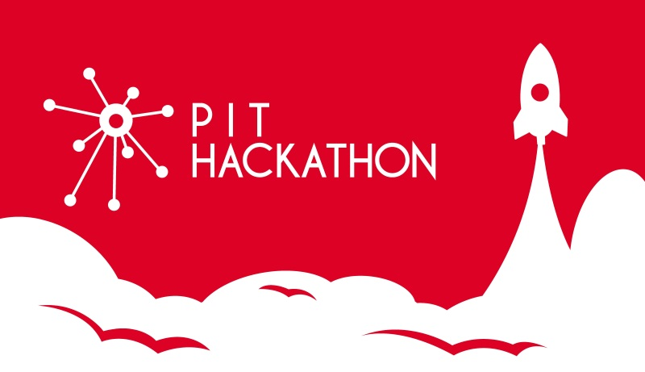

# PIT-Hackathon 2017 WebGame Phaser ES2017 Template
 A template to create games with Phaser using ES2017 and Webpack.

 You can try the game template online on [https://pit-hackathon.github.io/2017-WebGame-Phaser-ES2017/](https://pit-hackathon.github.io/2017-WebGame-Phaser-ES2017/)



# Requirements

- You need to have [Node.js](https://nodejs.org/en/) installed to work.

# Getting started

## 1. Make a copy
``` bash
# Clone this repository
git clone https://github.com/pit-hackathon/2017-webgame-phaser-es2017

# Don't forget to change the origin
git remote set-url origin {your repo url}
# or add a new one
git remote add my {your repo url}
```

## 2. Install NPM packages

``` bash
npm install
```

## 3. Start Development

``` bash
npm start
```

## 4. Build for deployment

Call ```npm run deploy``` to build the required pacakges for deployment.
Copy

# Credits
Big thanks to this great repos:

https://github.com/lean/phaser-es6-webpack
